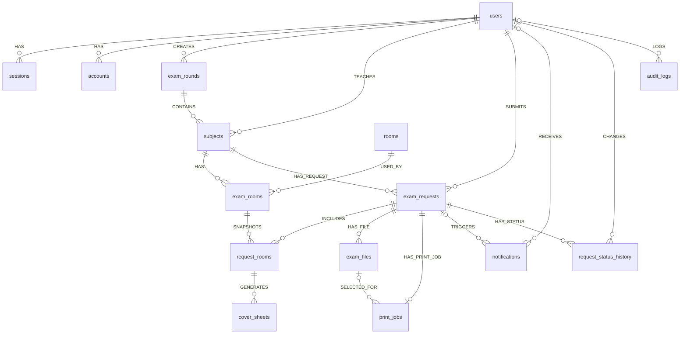

# ERD ที่ใช้จริง

ฉบับ 5 ตุลาคม 2569: เพิ่ม `subjects.faculty_name` สำหรับชื่อคณะบนใบปะหน้า เจ้าหน้าที่กรอกในฟอร์มรายวิชา ข้อมูลเดิม nullable โดยไม่สมมติชื่อคณะ ไม่มีตารางหรือความสัมพันธ์ใหม่

ฐานข้อมูลจริงมี 16 ตารางของระบบ (better_auth 4 / app 12) หลัง migration 0005 ซึ่งย้ายประวัติ deliveries และ distributions เข้า audit_logs ก่อนลบสองตารางที่เลิกใช้ ภาพ erd-domain.png เป็นภาพอ้างอิงเดิม ความสัมพันธ์ที่ใช้งานแสดงด้านล่าง ตารางภายใน drizzle.__drizzle_migrations ไม่ใช่ตารางธุรกิจและต้องเก็บไว้

`verifications` ไม่มี Foreign Key โดยตั้งใจ เพราะ Better Auth ใช้ identifier/value สำหรับ token อายุสั้น ตารางกลางที่แก้ความสัมพันธ์ many-to-many คือ `exam_rooms` (Subject–Room) และ snapshot ที่รับข้อมูลต่อห้องของคำขอคือ `request_rooms`

ฉบับ 3 ตุลาคม 2569: จบที่พิมพ์เสร็จแล้ว ไม่มี QR/รับมอบ/แจกจ่าย Migration 0005 ลบ deliveries และ distributions หลังตรวจว่าประวัติทุกแถวถูกเก็บใน audit_logs แล้ว โดยใช้ transaction และไม่ใช้ DROP CASCADE ข้อมูลคำขอ งานพิมพ์ ไฟล์ และสถานะย้อนหลังไม่เปลี่ยน

ฉบับ 13 กันยายน 2569: เพิ่ม `exam_requests.submission_form`, `request_rooms.base_copy_count`, `print_jobs.selected_exam_file_id/revision/confirmed_at`, `cover_sheets.print_revision` ไม่มีตารางใหม่ `exam_rooms.student_count` เป็นข้อมูลเดิม nullable เท่านั้น ยอดอาจารย์เก็บใน request_rooms.student_count และยอดพิมพ์ = base_copy_count + reserve_count ภาพ erd-domain.png เป็นภาพอ้างอิงเดิม ให้ใช้ physical relationship และ Data Dictionary ฉบับนี้สำหรับ implementation
