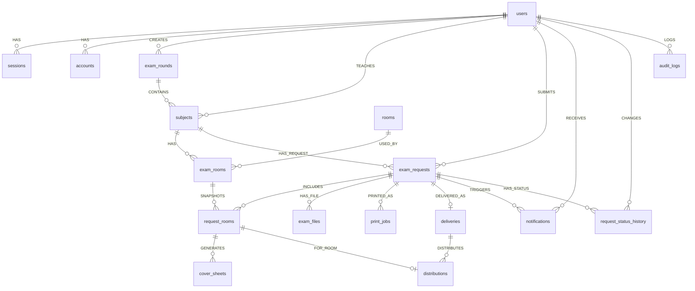

# ERD ที่ใช้จริง

ฐานข้อมูลมี 18 ตาราง แบ่งเป็น schema `better_auth` 4 ตารางและ `app` 14 ตาราง ภาพ `erd-domain.png` เป็น ERD กระบวนการธุรกิจแบบที่อนุมัติก่อนหน้า ส่วน physical relationship ฉบับที่ตรงกับ migration แสดงด้านล่าง

`verifications` ไม่มี Foreign Key โดยตั้งใจ เพราะ Better Auth ใช้ identifier/value สำหรับ token อายุสั้น ตารางกลางที่แก้ความสัมพันธ์ many-to-many คือ `exam_rooms` (Subject–Room) และ snapshot ที่รับข้อมูลต่อห้องของคำขอคือ `request_rooms`
